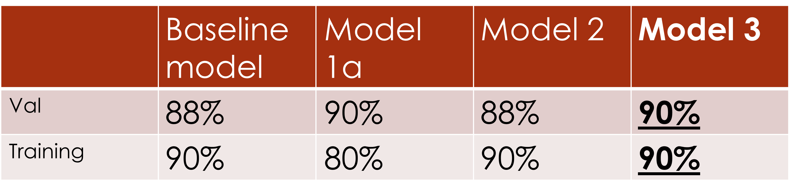
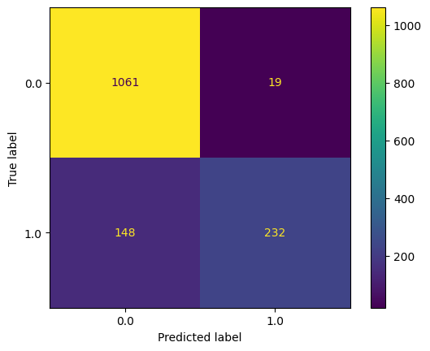

# Xray classification
Jonathan Marks

# Business Problem

The business problem is a radiologist who wants to double-check their work with a model that classifies x-rays as Pneumonia or normal.  The practice has supplied us with their x-rays that they have classified and has asked us to build a model which they can refer to on difficult to classify images. 

# Data Understanding

The data consists of 5,856 chest x-ray images. Each image is labelled as either normal or pneumonia.  25% of the images are labelled normal and 75% pneumonia.  The data comes from an x-ray imaging lab. 

### Example 

# Modeling

- initial model, a neural network with 1 hidden layer, with 64 neurons.

- model1a, a neural network with 1 hidden layer, with 32 neurons in order to reduce overfitting.

- model 2, baseline plus adding an additional layer with 32 neurons and same tanh activation function in order to increase accuracy.  

- model 3, by increasing the learning rate of the optimizer from default .001 to .05 in order to try to increase accuracy.  

Accuracy comparisons 

Accuracy of 1a on test set is 86%.

19 false negatives and 148 false positives out of 1460 predictions. False negatives represent pneumonia x-rays classified as normal and are more harmful than false positives. 1% false negative rate is acceptably low.  

# Results/Conclusions

Model3 performed best.  The chosen model's accuracy on the holdout test set was 88%.  This can be compared to guessing based on the sample balance, which would yield 73% accuracy.  The false negative rate was very low at 1%. Thus this model can be used as a check by the radiologist, for instance on x-rays that they are less certain about.    

# Recommendations and Future work

-This model can be used as a check by the radiologist, for instance on x-rays that they are less certain about.
-The model can be examined to determine the important features and the parts of the image that are most important for helpful insights.

### Future work

- Use CNN
- Alter activation functions`

## Contact information

jmarksk@gmail.com
5169963175

# Repository Structure
- Xray.ipynb
- README.md
- Xray_presentation.pdf